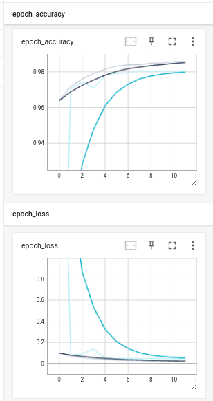

# Удаление водяных знаков и субтитров с изображений

## Оглавление

Проект состоит из двух основных частей

- [Сегментация субтитров и водяных знаков](#Сегментация-субтитров-и-водяных-знаков)
- [Зарисовка субтитров и водяных знаков](#Зарисовка-субтитров-и-водяных-знаков)

## Сегментация субтитров и водяных знаков

Чтобы сгенерировать датасет и обучить необходимо выполнить:

```bash
# Создание окружения
python3 -m venv .env
. .env/bin/activate
pip install -r requirements.txt

# Создание датасета
make clean
make tfds

# Обучение модели
make train
```

При обучении DeepLabV3+ после 10 эпох получилось следующее качество:



Реализация модели взята с официального сайта Keras. Почитать можно здесь: https://keras.io/examples/vision/deeplabv3_plus/

При обучении использовался SparseCategoricalCrossentropy лосс.

## Зарисовка субтитров и водяных знаков

Зарисковка субтитров и водяных знаков происходит с помощью модели представленной в [этом](https://github.com/daa233/generative-inpainting-pytorch) репозитории.

```bash
# Чтобы скачать репозиторий с моделью
git submodule update --init --recursive
```